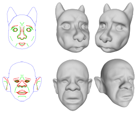
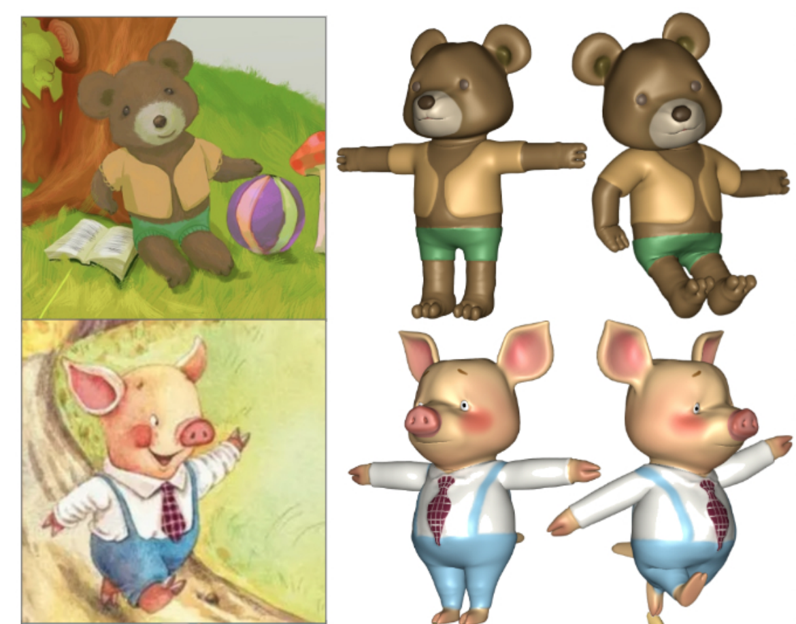
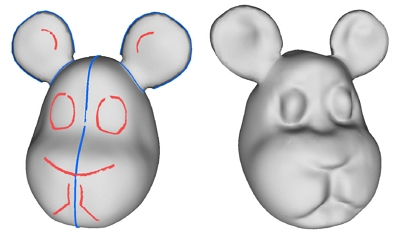
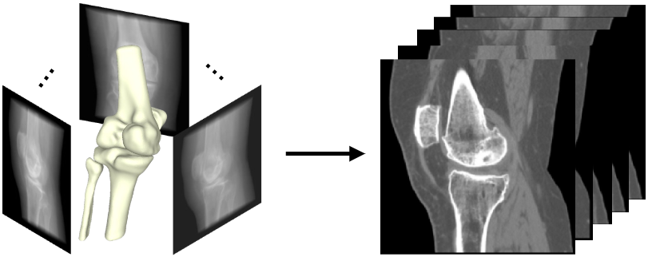
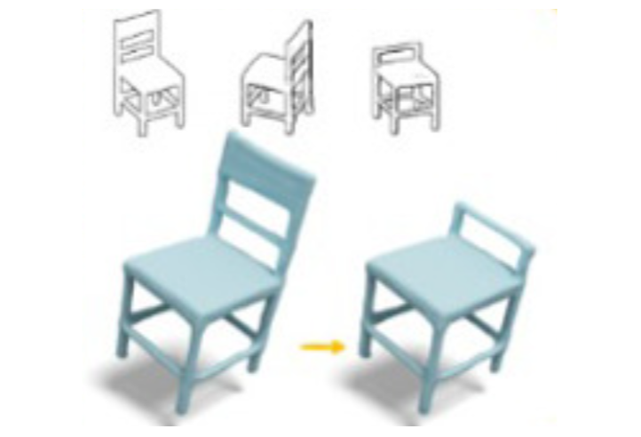

I am currently a second-year Ph.D. student at the School of Science and Engineering of the Chinese University of Hong Kong (Shenzhen), under the supervision of <a href="https://gaplab.cuhk.edu.cn/">Prof. Xiaoguang Han</a> at <a href="https://gaplab.cuhk.edu.cn/">GAP Lab</a>. Prior to this, I received my B.S. degree in Software Engineering from Tongji University. My research interests lie in computer graphics and 3D deep learning, with a primary focus on 3D content generation and reconstruction. I am also collaborating closely with <a href="http://sweb.cityu.edu.hk/hongbofu/index.htm">Prof. Hongbo Fu</a> at City University of Hong Kong.

<!-- ############## -->
<!-- interests -->
<!-- ############## -->

Interests
------
* Sketch-based 2D/3D Content Modeling
* Multi-Modal 3D Content Generation and Reconstruction
* Shape Representation & Geometric Processing

<!-- ############## -->
<!-- news -->
<!-- ############## -->

News
------
* [2023.06] One paper got accepted by MICCAI 2023.
* [2023.06] One paper got accepted by TVCG 2023.
* [2023.03] One paper got accepted by CVPR 2023.

<!-- ############## -->
<!-- publications -->
<!-- ############## -->

Publications
------

  

  

  

    
      <b><i>SketchMetaFace</i>: A Learning-based Sketching Interface for High-fidelity 3D Character Face Modeling</b>
       
     
    
      <b>Zhongjin Luo</b>, 
      Dong Du, 
      Heming Zhu, 
      <a href="https://i.cs.hku.hk/~yzyu/">Yizhou Yu</a>,
      <a href="http://sweb.cityu.edu.hk/hongbofu/index.htm">Hongbo Fu</a>,
      <a href="https://gaplab.cuhk.edu.cn/">Xiaoguang Han</a>
       
     
    
      Transactions on Visualization and Computer Graphics (<b>TVCG</b>), 2023
       
     
    
      <a href="../files/SketchMetaface.pdf">[paper]</a> /
      [project (coming soon...)] /
      [code (coming soon...)]
    
  

 

  

  

  

    
      <b><i>RaBit</i>: Parametric Modeling of 3D Biped Cartoon Characters with a Topological-consistent Dataset</b>
       
     
    
      <b>Zhongjin Luo*</b>, 
      Shengcai Cai*, 
      Jinguo Dong, 
      Ruibo Ming, 
      Liangdong Qiu, 
      <a href="https://xiaohangzhan.github.io/">Xiaohang Zhan</a>,
      <a href="https://gaplab.cuhk.edu.cn/">Xiaoguang Han</a> 
       
     
    
      IEEE Conference on Computer Vision and Pattern Recognition (<b>CVPR</b>), 2023 
       
     
    
      <a href="https://arxiv.org/abs/2303.12564">[paper]</a> / 
      <a href="https://gaplab.cuhk.edu.cn/projects/RaBit/">[project]</a> /
      <a href="https://github.com/zhongjinluo/RaBit">[code]</a>
    
  

 

  

  

  

    
      <b><i>SimpModeling</i>: Sketching Implicit Field to Guide Mesh Modeling for 3D Animalmorphic Head Design</b>
       
     
    
      <b>Zhongjin Luo</b>, 
      Jie Zhou, 
      Heming Zhu, 
      Dong Du, 
      <a href="https://gaplab.cuhk.edu.cn/">Xiaoguang Han</a>,
      <a href="http://sweb.cityu.edu.hk/hongbofu/index.htm">Hongbo Fu</a>
       
     
    
      ACM Symposium on User Interface Software and Technology (<b>UIST</b>), 2021
       
     
    
      <a href="https://arxiv.org/abs/2108.02548">[paper]</a> / 
      <a href="https://zhongjinluo.github.io/SimpModeling/">[project]</a> /
      <a href="https://zhongjinluo.github.io/SimpModeling/">[code]</a>
    
  

<!-- 

  

  

  

    
      <b>Disentangled Face Attribute Editing via Instance-Aware Latent Space Search</b>
       
     
    
      <b>Yuxuan Han</b>, 
      <a href="http://jlyang.org/">Jiaolong Yang</a>, 
      <a href="https://ying-fu.github.io/">Ying Fu</a>
       
     
    
      International Joint Conference on Artificial Intelligence (<b>IJCAI</b>), 2021 
       
     
    
      <a href="https://arxiv.org/abs/2105.12660">[paper]</a> / 
      <a href="https://github.com/yxuhan/IALS">[code]</a>
    
  

 -->

<!-- ############## -->
<!-- preprints -->
<!-- ############## -->

Preprints
------

  

  

  

    
      <b>Learning Deep Intensity Field for Extremely Sparse-View CBCT Reconstruction</b>
       
     
    
      Yiqun Lin,
      <b>Zhongjin Luo</b>, 
      Wei Zhao,
      Xiaomeng Li
       
     
    
      International Conference on Medical Image Computing&Computer Assisted Intervention (<b>MICCAI</b>), 2023
       
     
    
      <a href="https://arxiv.org/abs/2303.06681">[paper]</a> /
      [project (coming soon...)] /
      [code (coming soon...)]
    
  

 

  

  

  

    
      <b>GA-Sketching: Shape Modeling from Multi-View Sketching with Geometry-Aligned Deep Implicit Functions</b>
       
     
    
      Jie Zhou,
      <b>Zhongjin Luo</b>, 
      <a href="https://yuqian1023.github.io/">Yu Qian</a>,
      <a href="https://gaplab.cuhk.edu.cn/">Xiaoguang Han</a>,
      <a href="http://sweb.cityu.edu.hk/hongbofu/index.htm">Hongbo Fu</a>
       
     
    
      Arxiv 2023 (Pre-Print Coming soon...)
       
     
    <!-- 
      [paper] /
      [project] /
      [code]
     -->
  

<!-- ############## -->
<!-- education -->
<!-- ############## -->

<!-- Education Experience -->
<!-- ------ -->
<!--  -->
<!-- 

  <b>Tsinghua University, Beijing, China</b>  
  September 2022 -    
  Ph.D. in Software Engineering at <a href="https://www.thss.tsinghua.edu.cn/en/">School of Software</a> 

  

  <b>Beijing Institute of Technology, Beijing, China</b>  
  September 2018 - June 2022  
  B.E. in Computer Science at <a href="https://xuteli.bit.edu.cn/">Xu Class</a> 
   <b>GPA 90.0, rank 2/56</b>  

  

 -->

<!-- ############## -->
<!-- visit map -->
<!-- ############## -->

<!--  -->
