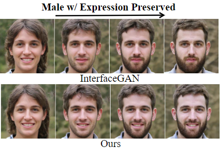

<!-- I am currently a first-year Ph.D. student at [Tsinghua University](https://www.tsinghua.edu.cn/en/), under the supervision of Prof. [Feng Xu](http://xufeng.site/).
Before that, I received my B.S. degree of Computer Science ([Xuteli School](https://xuteli.bit.edu.cn/english/index.htm)) from [Beijing Institute of Technology](https://english.bit.edu.cn/) at 2022, under the supervision of Prof. [Ying Fu](https://ying-fu.github.io/).

My research interests lies at the intersection of machine learning, computer vision, and computer graphics, including neural rendering, visual geometric computing, and face modeling. -->

<!-- ############## -->
<!-- news -->
<!-- ############## -->

News
------
* [2023.3] One paper got accepted to CVPR 2023.
<!-- * [2022.5] One paper accepted to SIGGRAPH'2022. -->
<!-- * [2021.5] One paper accepted to IJCAI'2021. -->

<!-- ############## -->
<!-- education -->
<!-- ############## -->

Education Experience
------
<!--  -->
<!-- 

  <b>Tsinghua University, Beijing, China</b>  
  September 2022 -    
  Ph.D. in Software Engineering at <a href="https://www.thss.tsinghua.edu.cn/en/">School of Software</a> 

  

  <b>Beijing Institute of Technology, Beijing, China</b>  
  September 2018 - June 2022  
  B.E. in Computer Science at <a href="https://xuteli.bit.edu.cn/">Xu Class</a> 
   <b>GPA 90.0, rank 2/56</b>  

  

 -->

<!-- ############## -->
<!-- publications -->
<!-- ############## -->

Publications
------

<!-- 

  

  

  

    
      <b>Learning a 3D Morphable Face Reflectance Model from Low-cost Data</b>
       
     
    
      <b>Yuxuan Han</b>, 
      <a href="https://sireer.github.io/">Zhibo Wang</a>,
      <a href="http://xufeng.site/">Feng Xu</a> 
       
     
    
      IEEE Conference on Computer Vision and Pattern Recognition (<b>CVPR</b>), 2023 
       
     
    
      <a href="https://arxiv.org/abs/2303.11686">[paper]</a> / 
      <a href="../ReflectanceMM/index.html">[project]</a> /
      <a href="https://github.com/yxuhan/ReflectanceMM">[code]</a>
    
  

 

  

  

  

    
      <b>Single-View View Synthesis in the Wild with Learned Adaptive Multiplane Images</b>
       
     
    
      <b>Yuxuan Han</b>, 
      <a href="https://github.com/EasternJournalist">Ruicheng Wang</a>,
      <a href="http://jlyang.org/">Jiaolong Yang</a> 
       
     
    
      <b>ACM SIGGRAPH (Conference Track)</b>, 2022 
       
     
    
      <a href="https://arxiv.org/abs/2205.11733">[paper]</a> / 
      <a href="../AdaMPI/index.html">[project]</a> /
      <a href="https://github.com/yxuhan/AdaMPI">[code]</a>
    
  

 

  

  

  

    
      <b>Disentangled Face Attribute Editing via Instance-Aware Latent Space Search</b>
       
     
    
      <b>Yuxuan Han</b>, 
      <a href="http://jlyang.org/">Jiaolong Yang</a>, 
      <a href="https://ying-fu.github.io/">Ying Fu</a>
       
     
    
      International Joint Conference on Artificial Intelligence (<b>IJCAI</b>), 2021 
       
     
    
      <a href="https://arxiv.org/abs/2105.12660">[paper]</a> / 
      <a href="https://github.com/yxuhan/IALS">[code]</a>
    
  

 -->

<!-- **** -->

Professional Experience
------
<!-- 

  <b>Microsoft Research Asia, Beijing, China</b>  
  December 2021 - April 2022  
  Research Intern at Internet Graphics Group 
   Mentored by <a href="http://jlyang.org/">Jiaolong Yang</a>

  

 -->

<!-- ############## -->
<!-- honors and awards -->
<!-- ############## -->

Honors & Awards
------
<!-- * Xu Scholarship Nomination (the highest honor in [BIT](https://english.bit.edu.cn/), 20 candidates per year), 2021
* National Scholarship, 2020 -->

<!-- ############## -->
<!-- visit map -->
<!-- ############## -->

<!--  -->
