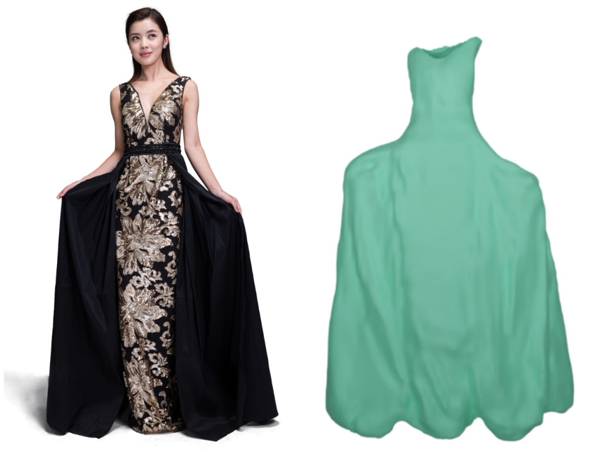

I am currently a Postdoctoral Research Fellow at MMLab@CUHK, working with <a href="https://www.ee.cuhk.edu.hk/~hsli/" target="_blank">Prof. Hongsheng Li</a>. Prior to this, I obtained my Ph.D. at <a href="https://gaplab.cuhk.edu.cn/" target="_blank">GAP Lab</a>, advised by Prof. Xiaoguang Han at the Chinese University of Hong Kong (Shenzhen). Previously, I received my B.S. degree in Software Engineering from Tongji University. My research interests lie in computer graphics and 3D deep learning, with a primary focus on 3D content generation and reconstruction.

<!-- ############## -->
<!-- interests -->
<!-- ############## -->

Interests
------
* 3D Content Generation and Reconstruction
* Sketch-based 2D/3D Content Modeling
* Shape Representation & Geometry Processing & Character Animation

<!-- ############## -->
<!-- news -->
<!-- ############## -->

News
------
* [2024.07] One paper got accepted by SIGGRAPH Asia 2024 (Journal).
* [2023.06] One paper got accepted by MICCAI 2023.
* [2023.06] One paper got accepted by TVCG 2023.
* [2023.03] One paper got accepted by CVPR 2023.

<!-- ############## -->
<!-- publications -->
<!-- ############## -->

Publications
------

  

  

  

    
      <b>Stable-SCore: A Stable Registration-based Framework for 3D Shape Correspondence</b>
       
     
     
      Haolin Liu, Xiaohang Zhan, Zizheng Yan, <b>Zhongjin Luo</b>, Yuxin Wen, Xiaoguang Han
       
     
    
      IEEE Conference on Computer Vision and Pattern Recognition (CVPR), 2025
       
     
    
      <a href="https://arxiv.org/abs/2506.18017">[paper]</a>
      <a href="https://haolinliu97.github.io/Stable-Score/">[project]</a> 
    
  

 

  

  

  

    
      <b>BAG: Body-Aligned 3D Wearable Asset Generation</b>
       
     
    
      <b>Zhongjin Luo</b>, 
      Yang Li, 
      Mingrui Zhang, 
      Senbo Wang,
      Han Yan,
      Xibin Song,
      Taizhang Shang, 
      Wei Mao, 
      Hongdong Li, 
      Xiaoguang Han,
      Pan Ji
       
     
    
      Arxiv preprint, 2025
       
     
    
      <a href="https://arxiv.org/abs/2501.16177">[paper]</a>
      <a href="https://bag-3d.github.io/">[project]</a> 
    
  

 

  

  

  

    
      <b>GarVerseLOD: High-Fidelity 3D Garment Reconstruction from a Single In-the-Wild Image using a Dataset with Levels of Details</b>
       
     
    
      <b>Zhongjin Luo</b>, 
      <a href="https://haolinliu97.github.io/">Haolin Liu</a>, 
      <a href="https://kevinlee09.github.io/">Chenghong Li</a>, 
      Wanghao Du,
      Zirong Jin,
      Wanhu Sun,
      <a href="https://yinyunie.github.io/">Yinyu Nie</a>,
      <a href="https://chenweikai.github.io/">Weikai Chen</a>,
      <a href="https://gaplab.cuhk.edu.cn/">Xiaoguang Han</a>
       
     
    
      ACM Transactions on Graphics (Proc. SIGGRAPH Asia), 2024
       
     
    
      <a href="https://arxiv.org/abs/2411.03047">[paper]</a> /
      <a href="https://garverselod.github.io/">[project]</a> /
      <a href="https://github.com/zhongjinluo/GarVerseLOD">[code]</a>
    
  

 

  

  

  

    
      <b><i>SketchMetaFace</i>: A Learning-based Sketching Interface for High-fidelity 3D Character Face Modeling</b>
       
     
    
      <b>Zhongjin Luo</b>, 
      Dong Du, 
      Heming Zhu, 
      <a href="https://i.cs.hku.hk/~yzyu/">Yizhou Yu</a>,
      <a href="http://sweb.cityu.edu.hk/hongbofu/index.htm">Hongbo Fu</a>,
      <a href="https://gaplab.cuhk.edu.cn/">Xiaoguang Han</a>
       
     
    
      Transactions on Visualization and Computer Graphics (TVCG), 2023
       
     
    
      <a href="https://arxiv.org/abs/2307.00804">[paper]</a> /
      <a href="https://zhongjinluo.github.io/SketchMetaFace/">[project]</a> /
      <a href="https://github.com/zhongjinluo/SketchMetaFace/">[code]</a>
    
  

 

  

  

  

    
      <b><i>RaBit</i>: Parametric Modeling of 3D Biped Cartoon Characters with a Topological-consistent Dataset</b>
       
     
    
      <b>Zhongjin Luo*</b>, 
      Shengcai Cai*, 
      Jinguo Dong, 
      Ruibo Ming, 
      Liangdong Qiu, 
      <a href="https://xiaohangzhan.github.io/">Xiaohang Zhan</a>,
      <a href="https://gaplab.cuhk.edu.cn/">Xiaoguang Han</a> 
       
     
    
      IEEE Conference on Computer Vision and Pattern Recognition (CVPR), 2023 
       
     
    
      <a href="https://arxiv.org/abs/2303.12564">[paper]</a> / 
      <a href="https://gaplab.cuhk.edu.cn/projects/RaBit/">[project]</a> /
      <a href="https://github.com/zhongjinluo/RaBit">[code]</a>
    
  

 

  

  

  

    
      <b>Learning Deep Intensity Field for Extremely Sparse-View CBCT Reconstruction</b>
       
     
    
      Yiqun Lin,
      <b>Zhongjin Luo</b>, 
      Wei Zhao,
      Xiaomeng Li
       
     
    
      International Conference on Medical Image Computing&Computer Assisted Intervention (MICCAI), 2023
       
     
    
      <a href="https://arxiv.org/abs/2303.06681">[paper]</a> /
      <a href="https://github.com/xmed-lab/DIF-Net/">[code]</a>
    
  

 

  

  

  

    
      <b>GA-Sketching: Shape Modeling from Multi-View Sketching with Geometry-Aligned Deep Implicit Functions</b>
       
     
    
      Jie Zhou,
      <b>Zhongjin Luo</b>, 
      <a href="https://yuqian1023.github.io/">Yu Qian</a>,
      <a href="https://gaplab.cuhk.edu.cn/">Xiaoguang Han</a>,
      <a href="http://sweb.cityu.edu.hk/hongbofu/index.htm">Hongbo Fu</a>
       
     
    
      Pacific Graphics (PG), 2023
       
     
    
      <a href="https://arxiv.org/abs/2309.05946">[paper]</a> /
      <a href="https://github.com/LordLiang/GA-Sketching">[code]</a>
    
  

 

  

  

  

    
      <b><i>SimpModeling</i>: Sketching Implicit Field to Guide Mesh Modeling for 3D Animalmorphic Head Design</b>
       
     
    
      <b>Zhongjin Luo</b>, 
      Jie Zhou, 
      Heming Zhu, 
      Dong Du, 
      <a href="https://gaplab.cuhk.edu.cn/">Xiaoguang Han</a>,
      <a href="http://sweb.cityu.edu.hk/hongbofu/index.htm">Hongbo Fu</a>
       
     
    
      ACM Symposium on User Interface Software and Technology (UIST), 2021
       
     
    
      <a href="https://arxiv.org/abs/2108.02548">[paper]</a> / 
      <a href="https://zhongjinluo.github.io/SimpModeling/">[project]</a> /
      <a href="https://github.com/zhongjinluo/SimpModeling/">[code]</a>
    
  

<!-- 

  

  

  

    
      <b>Disentangled Face Attribute Editing via Instance-Aware Latent Space Search</b>
       
     
    
      <b>Yuxuan Han</b>, 
      <a href="http://jlyang.org/">Jiaolong Yang</a>, 
      <a href="https://ying-fu.github.io/">Ying Fu</a>
       
     
    
      International Joint Conference on Artificial Intelligence (<b>IJCAI</b>), 2021 
       
     
    
      <a href="https://arxiv.org/abs/2105.12660">[paper]</a> / 
      <a href="https://github.com/yxuhan/IALS">[code]</a>
    
  

 -->

<!-- ############## -->
<!-- education -->
<!-- ############## -->

<!-- Education Experience -->
<!-- ------ -->
<!--  -->
<!-- 

  <b>Tsinghua University, Beijing, China</b>  
  September 2022 -    
  Ph.D. in Software Engineering at <a href="https://www.thss.tsinghua.edu.cn/en/">School of Software</a> 

  

  <b>Beijing Institute of Technology, Beijing, China</b>  
  September 2018 - June 2022  
  B.E. in Computer Science at <a href="https://xuteli.bit.edu.cn/">Xu Class</a> 
   <b>GPA 90.0, rank 2/56</b>  

  

 -->

<!-- ############## -->
<!-- visit map -->
<!-- ############## -->

<!--  -->
